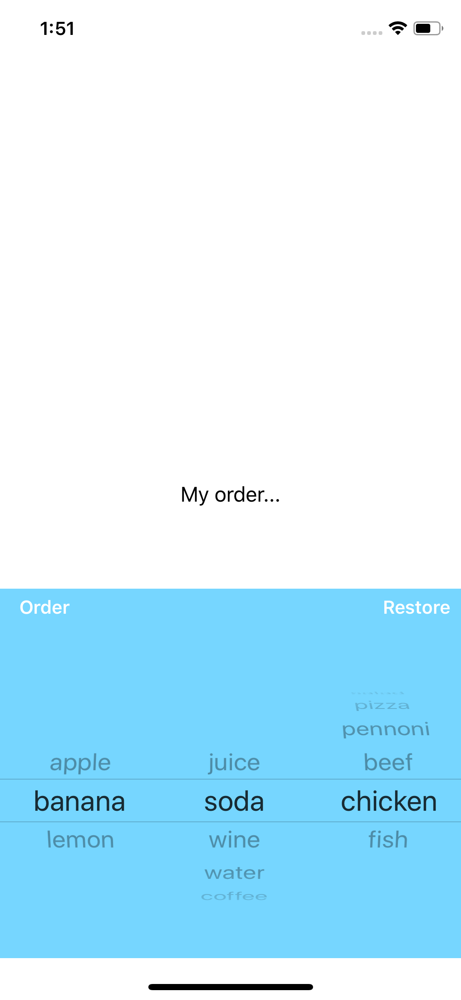
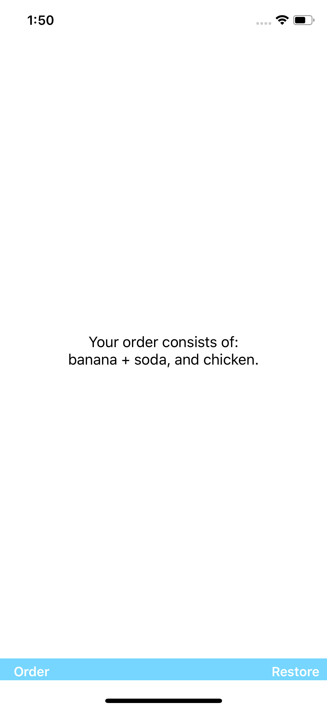

# MyOrder
 PickerView example built in Swift 4.2

This is a screenshot of this simple project, working with a UIPickerView.   
  
In this example after selecting different components representing a menu, clicking on the order button, the lable 'My order...' will be replaced by the items chosen and the pickerView (menu) will slide down with a delay of 0.5 sec. 
 
A very simple example using the Model-View-Controller (MVC) architecture. 
